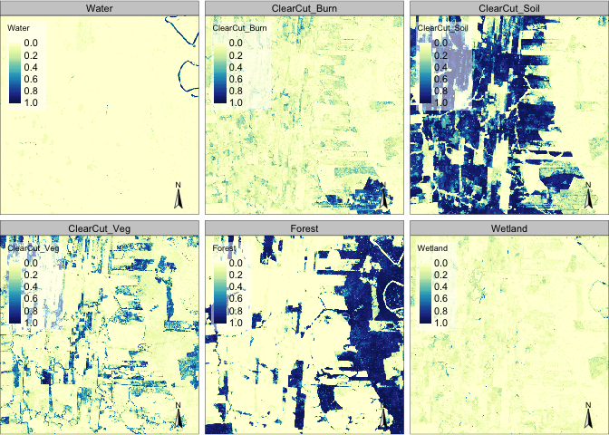
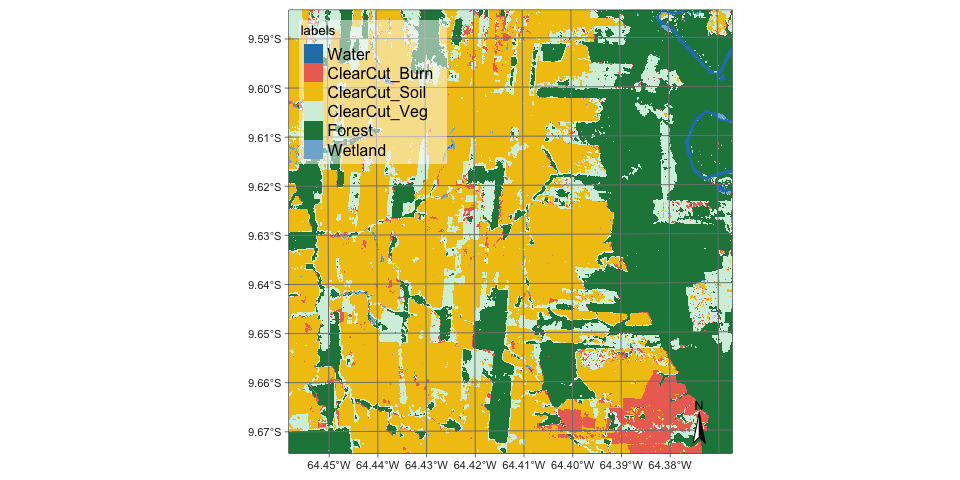
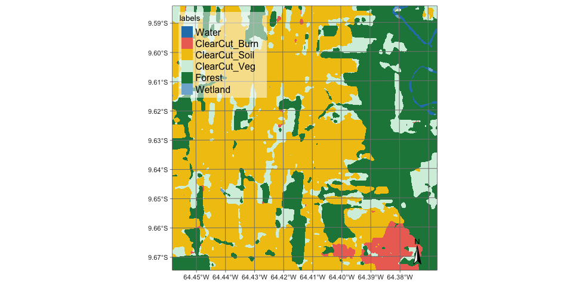

Bayesian Smoothing of Remote Sensing Image Classification
================
2023-05-21

    ## bayesEO - Bayesian Smoothing of Remote Sensing Image Classification.

    ## Loaded bayesEO v1.4.0.
    ##              See ?bayesEO for help, citation("bayesEO") for use in publication.

## Overview

Methods such as support vector machines, random forests, and deep
learning have become the popular for remote sensing image
classification. Images resulting from these classifiers frequently have
outliers or misclassified pixels. For this reason, image post-processing
techniques are widely used to refine the labelling in a classified image
in order to enhance its classification accuracy.

The `bayesEO` package provides a new method for Bayesian post-processing
of images produced by machine learning algorithms. The input to the
package is an image containing the probabilities of that pixel belonging
to each of the classes. The package provides efficient methods for
removing outliers and improving class labelling.

## Reading a probability data cube

The input for post-classification is an image with probabilities
produced by a machine learning algorithm. This file should be
multi-band, where each band contains the pixel probabilities of a single
class. The file name must have information on reference dates and
include a version number. In the examples, we use a file produced by a
random forests algorithm applied to a data cube of Sentinel-2 images for
tile “20LLQ” in the period 2020-06-04 to 2021-08-26. The image has been
stored as INT2S data type with integer values between \[0..10000\] to
represent probabilities ranging from 0 ro 1.

``` r
data_dir <- system.file("/extdata/probs/", package = "bayesEO")
file <- list.files(data_dir)
# read the file with the terra package
probs_image <- terra::rast(paste0(data_dir, "/", file))
```

The training data has six classes: (a) for natural tropical forest; (b)
for lakes and rivers; (c) for areas where water covers the soil in the
wet season; (d) for areas where fires cleared the land after tree
removal. (e) where the forest has been removed; (f) where some
vegetation remains after most trees have been removed. The class labels
should also be informed by the user and associated with the SpatRaster
terra object, since they are not stored in image files.

``` r
labels <- c("Water", "ClearCut_Burn", "ClearCut_Soil",
            "ClearCut_Veg", "Forest", "Wetland")
names(probs_image) <- labels
```

The figure below shows the plot of all layer of the probability image.
The map for class shows high probability values associated with compact
patches and linear stretches in riparian areas. Class is mostly composed
of dense areas of high probability whose geometrical boundaries result
from forest cuts. By contrast, the probability maps for classes , , and
have mostly low values. Note that we need to inform the scaling
parameter that converts the image to \[0..1\] interval.

``` r
bayes_plot(probs_image, scale = 0.0001)
```

<div class="figure" style="text-align: center">


<p class="caption">
Class probabilities produced by random forest algorithm.
</p>

</div>

The non-smoothed labeled map shows the need for post-processing. This
map is obtained by taking the class of higher probability to each pixel,
without considering the spatial context. The resulting map contains a
significant number of outliers and misclassified pixels.

``` r
map_no_smooth <- bayes_label(probs_image)
bayes_map(map_no_smooth)
```

<div class="figure" style="text-align: center">


<p class="caption">
Labelled map without smoothing.
</p>

</div>

## Removing Outliers for the Probability Image

To remove the outliers in the classification map, provides . This
function uses a Bayesian estimator. After the procedure has been
applied, the resulting smoothed probability image can be converted into
a map.

``` r
smooth_image <- bayes_smooth(probs_image)
smooth_map <- bayes_label(smooth_image)
bayes_map(smooth_map)
```

<div class="figure" style="text-align: center">


<p class="caption">
Labelled map with smoothing.
</p>

</div>

The outliers have been removed and the resulting labelled map has
improved accuracy.
